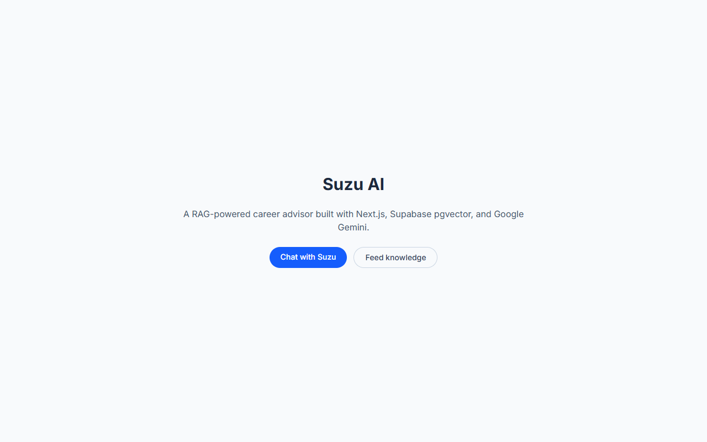
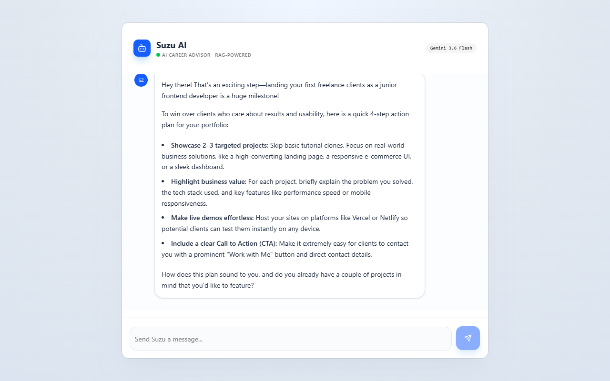
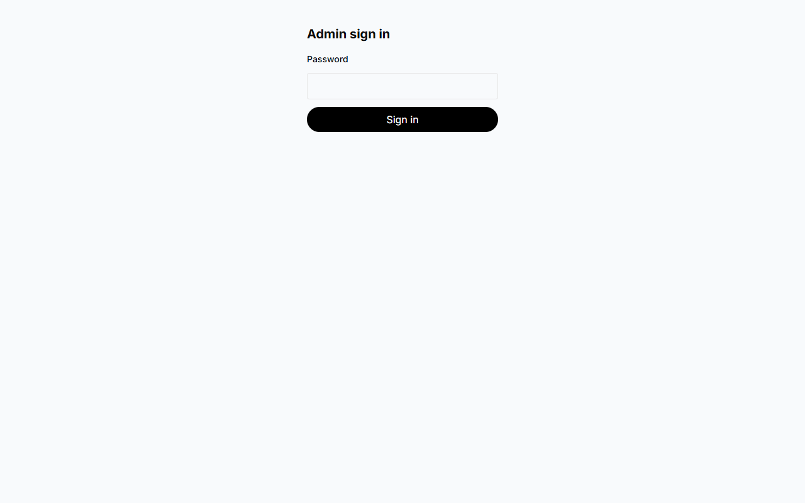

# Suzu AI (next-ai-advanced)

**Suzu AI** — a RAG-powered (Retrieval-Augmented Generation) career advisor chatbot built with Next.js, Supabase (Postgres + pgvector), and Google Gemini, ready to deploy on Supabase Cloud and Vercel.

**Live demo:** [https://next-ai-advanced.vercel.app](https://next-ai-advanced.vercel.app)

## Screenshots

| Landing | Chat (streaming answer with RAG context) | Admin sign-in |
|---------|-------------------------------------------|---------------|
|  |  |  |

## Highlights

- Retrieval-Augmented Generation over a Supabase `pgvector` store, with query embeddings produced by a Supabase Edge Function.
- Streaming chat UI built on the AI SDK v7 (`ai`, `@ai-sdk/react`, `@ai-sdk/google`) with automatic model fallback on quota or overload errors.
- Password-protected admin area for feeding knowledge to the bot, with signed httpOnly session cookies and a shared secret between the app and the Edge Function.
- Per-IP rate limiting and message size caps on the chat API.
- Playwright end-to-end tests (including live Gemini calls), Node unit tests and Deno tests for the Edge Function.

## 1. Overview

Suzu is a hands-on career advisor chat assistant. It answers questions using knowledge stored in a Supabase vector database (RAG), falling back to the model's own expertise when no relevant context is found.

### How it works

```
User message (/chat)
   │
   ▼
POST /api/chat ──► Supabase Edge Function `Embedding` (Google gemini-embedding-001, 768 dims)
   │                       │
   │                       ▼
   │              returns query embedding
   ▼
Supabase RPC `match_page_sections` (pgvector similarity search)
   │
   ▼
Matched context + instructions ──► Gemini 3.6 Flash (streaming, AI SDK 7) ──► UI
                                   (falls back to 3.5 Flash / 3.5 Flash-Lite on 429/503)
```

Knowledge ingestion:

- **Admin page** (`/admin`, password protected — see [Admin access](#9-admin-access)): paste documents into a textarea → `POST /api/ingest` splits the text into one chunk per non-empty line and sends each chunk to the `Embedding` Edge Function with `isIngest: true`.
- **Edge Function** (`Embedding` with `isIngest: true`): embeds the chunk with Google `gemini-embedding-001` (768 dims, the same model used for chat queries) and inserts it into `nods_page_section` with the service-role key.
- **Server action** (`app/actions/embed.ts` → `saveDocument`): same pipeline as `/api/ingest`, for a single document.
- **Batch script** (`npm run embeddings`): embeds `.md`/`.mdx` files from a `./pages` directory with the same Gemini embedding model (requires `SUPABASE_SERVICE_ROLE_KEY`).

## 2. Tech stack

| Area | Package | Version |
| --- | --- | --- |
| Framework | `next` (App Router, Turbopack) | 16.3 |
| UI | `react` / `react-dom` | 19.3 |
| Styling | `tailwindcss` + shadcn/ui, `tw-animate-css` | 4.3 |
| AI | `ai` / `@ai-sdk/react` / `@ai-sdk/google` | 7.0 / 4.0 / 4.0 |
| Chat model | Google `gemini-3.6-flash` (fallbacks: `gemini-3.5-flash`, `gemini-3.5-flash-lite`) | — |
| Embeddings | Google `gemini-embedding-001`, 768 dims | — |
| Database | `@supabase/supabase-js`, Postgres + pgvector (HNSW), RLS, Edge Functions (Deno) | 2.117 |
| Markdown | `streamdown` | 2.6 |
| Tooling | TypeScript / ESLint / Prettier | 6.0 / 10 / 3.9 |
| E2E tests | `@playwright/test` (Chromium) | 1.63 |

Model names live in [lib/models.ts](lib/models.ts); the fallback logic is in [lib/chat-model.ts](lib/chat-model.ts).

> TypeScript stays on 6.0: `typescript-eslint` (used by `eslint-config-next`) does not support TypeScript 7 yet.

## 3. Project structure

```
app/
  page.tsx                  # Landing page
  chat/page.tsx             # Main chat UI (Suzu AI)
  admin/page.tsx            # Admin page (server-checks the session, renders the ingest form)
  admin/ingest-form.jsx     # Client form that posts to /api/ingest
  admin/login/              # Admin sign-in page + form
  admin/actions.ts          # Server actions: login / logout
  components/SuzuChat.tsx   # Alternative chat component (not routed)
  actions/embed.ts          # Server action: save a document via the Edge Function (admin only)
  api/
    chat/route.ts           # Chat endpoint: rate limit + RAG search + Gemini streaming
    ingest/route.ts         # Ingest endpoint (admin only): chunk + embed (Edge Function) + store
proxy.ts                    # Next.js 16 Proxy (ex-middleware): optimistic admin check
lib/
  models.ts                 # Chat / embedding model ids (shared with the UI)
  chat-model.ts             # Gemini model with 429/503 fallback middleware (server only)
  chat-guard.ts             # Chat history validation / size caps
  rate-limit.ts             # Sliding-window rate limiter (pluggable store)
  admin-session.ts          # Admin password check + HMAC-signed session tokens (Web Crypto)
  admin-auth.ts             # Admin session cookie helpers (next/headers)
  embedding-function.ts     # URL + headers (incl. x-ingest-secret) for the Edge Function
  ingest.ts                 # Shared ingest helper (calls the Edge Function)
  generate-embeddings.ts    # Batch script: embed ./pages/**/*.md(x) with Gemini
e2e/                        # Playwright end-to-end tests
tests/unit/                 # Unit tests (node:test via tsx)
playwright.config.ts        # Playwright config (web server on port 3102)
supabase/
  functions/Embedding/      # Edge Function: Google embeddings + optional ingest (requires x-ingest-secret)
  migrations/               # Schema, RLS read policies, match_page_sections RPC, HNSW index
```

## 4. Prerequisites

- Node.js 20.9+ (tested on Node 24)
- npm 10+
- Supabase CLI 2.8x recommended

### Install / update Supabase CLI

Supabase CLI is not an npm package. If you used `npm update supabase -g`, that is expected to fail.

- Windows (Scoop): `scoop install supabase` then `scoop update supabase`
- Windows (Chocolatey): `choco install supabase` then `choco upgrade supabase`
- macOS (Homebrew): `brew install supabase/tap/supabase` then `brew upgrade supabase`

Check version:

```bash
supabase --version
```

## 5. Local setup

### 5.1 Install dependencies

```bash
npm install
```

### 5.2 Set up app env

Copy [.env.example](.env.example) to `.env.local` and fill in real values.

Required keys:

| Key | Description |
| --- | --- |
| `NEXT_PUBLIC_SUPABASE_URL` | Supabase project URL |
| `NEXT_PUBLIC_SUPABASE_PUBLISHABLE_KEY` | Supabase anon/publishable key |
| `SUPABASE_SERVICE_ROLE_KEY` | Supabase service role key (server only; used by `npm run embeddings`) |
| `GOOGLE_GENERATIVE_AI_API_KEY` | Google AI Studio API key (Gemini) |
| `ADMIN_PASSWORD` | Password for `/admin`. If unset, admin is **locked** (fail closed) |
| `ADMIN_SESSION_SECRET` | Random string (32+ chars) used to sign the admin session cookie. If unset/short, admin is locked |
| `INGEST_SECRET` | Shared secret sent to the `Embedding` Edge Function as `x-ingest-secret`. Must equal the function's `INGEST_SECRET` secret. Without it ingest fails, and chat answers without RAG context once the redeployed function enforces the secret |

Optional keys:

| Key | Default | Description |
| --- | --- | --- |
| `CHAT_RATE_LIMIT_PER_MIN` | `10` | Max `/api/chat` requests per client IP per minute |
| `CHAT_MAX_MESSAGE_CHARS` | `4000` | Max characters in the latest user message (older messages are truncated to this) |
| `CHAT_MAX_HISTORY_MESSAGES` | `20` | Only the most recent N messages are sent to the model |
| `ADMIN_LOGIN_RATE_LIMIT_PER_MIN` | `10` | Max sign-in attempts per client IP per minute |

Generate secrets with e.g. `node -e "console.log(require('crypto').randomBytes(32).toString('base64url'))"` (use different values for `ADMIN_SESSION_SECRET` and `INGEST_SECRET`).

### 5.3 Set up function env (local serve)

Copy [supabase/functions/.env.secrets.example](supabase/functions/.env.secrets.example) to `supabase/functions/.env.secrets` and fill in values.

Required keys:

- `EDGE_SUPABASE_URL`
- `EDGE_SERVICE_ROLE_KEY`
- `GOOGLE_GENERATIVE_AI_API_KEY`
- `INGEST_SECRET` (same value as the app's `INGEST_SECRET`)

On Supabase Cloud, `SUPABASE_URL` and `SUPABASE_SERVICE_ROLE_KEY` are injected automatically and are used as fallbacks.

### 5.4 Run the app

```bash
npm run dev
```

Open:

- `/` — landing page
- `/chat` — chat with Suzu
- `/admin` — feed knowledge to the AI

Optional: run the edge function locally

```bash
npm run functions
```

## 6. Supabase Cloud setup (new project)

### 6.1 Create a project and collect keys

In the Supabase dashboard, create a new project and collect:

- Project URL
- Project ref
- anon/publishable key
- service_role key

### 6.2 Link the local repo to the cloud project

```bash
supabase login
supabase link --project-ref YOUR_PROJECT_REF
```

### 6.3 Push schema and RPC

```bash
supabase db push
```

This applies migrations including:

- Base tables (`nods_page`, `nods_page_section`) with pgvector `vector(768)` embeddings
- Full-text search column and GIN index
- `match_page_sections` RPC used by the chat route

### 6.4 Set function secrets

Use an env file (recommended):

```bash
supabase secrets set --env-file ./supabase/functions/.env.secrets
```

Or set them directly:

```bash
supabase secrets set EDGE_SUPABASE_URL=https://YOUR_PROJECT_REF.supabase.co EDGE_SERVICE_ROLE_KEY=your_service_role_key_here
```

The Edge Function also needs the Google key for embeddings:

```bash
supabase secrets set GOOGLE_GENERATIVE_AI_API_KEY=your_google_ai_key
```

And the shared secret that the Next.js server sends as `x-ingest-secret` (the function rejects every request without it, with 401, and returns 503 if the secret is not configured):

```bash
supabase secrets set INGEST_SECRET=the_same_value_as_the_app_INGEST_SECRET
```

### 6.5 Deploy the edge function

```bash
supabase functions deploy Embedding --project-ref YOUR_PROJECT_REF --no-verify-jwt
```

The function uses `Deno.serve` and imports `@supabase/supabase-js` through the `npm:` specifier declared in [supabase/functions/Embedding/deno.json](supabase/functions/Embedding/deno.json). Redeploy it after pulling changes to that folder.

`--no-verify-jwt` is intentional: the function is only called server-to-server by Next.js and is protected by the `x-ingest-secret` header instead of a Supabase JWT.

> **Upgrading from a version without `INGEST_SECRET`:** set `INGEST_SECRET` in the app (`.env.local` + Vercel) and in the function secrets **first**, redeploy Vercel, then redeploy the function. If the function is redeployed first, chat keeps working but without RAG context (the query embedding call gets 401) until the app sends the secret.

## 7. Vercel deployment

### 7.1 Import the repo

Import this repository into Vercel.

### 7.2 Add env vars in Vercel

Set the same app envs as `.env.local`:

- `NEXT_PUBLIC_SUPABASE_URL`
- `NEXT_PUBLIC_SUPABASE_PUBLISHABLE_KEY`
- `SUPABASE_SERVICE_ROLE_KEY`
- `GOOGLE_GENERATIVE_AI_API_KEY`
- `ADMIN_PASSWORD`
- `ADMIN_SESSION_SECRET`
- `INGEST_SECRET`
- Optional: `CHAT_RATE_LIMIT_PER_MIN`, `CHAT_MAX_MESSAGE_CHARS`, `CHAT_MAX_HISTORY_MESSAGES`, `ADMIN_LOGIN_RATE_LIMIT_PER_MIN`

### 7.3 Deploy

The Vercel build command is `npm run build`.

`build` is set to `next build` to avoid running embedding generation during deploy.

## 8. Testing

### 8.1 Playwright end-to-end tests

One-time setup:

```bash
npx playwright install chromium
```

Run:

```bash
npm run test:e2e        # headless; builds the app and serves it on http://localhost:3102
npm run test:e2e:ui     # Playwright UI mode
```

The suite (in [e2e/](e2e)) covers:

| File | Tests |
| --- | --- |
| `e2e/pages.spec.ts` | Landing page and navigation; `/chat` renders, a typed message is sent and a (mocked) streamed reply is rendered; error state; `/admin` (signed in) renders and submits to a mocked `/api/ingest` |
| `e2e/admin-auth.spec.ts` | `/admin` redirects to `/admin/login` when signed out; wrong password rejected; correct password grants access (httpOnly, SameSite=Lax cookie); forged cookie rejected; logout; `/api/ingest` returns 401 without a valid session |
| `e2e/rate-limit.spec.ts` | `/api/chat` returns 429 (with `Retry-After`) after the per-IP limit; over-long message returns 413; the chat UI shows the 429 message |
| `e2e/chat-live.spec.ts` | **LIVE**: sends a prompt in the real UI and waits for a streamed Gemini reply |
| `e2e/api.spec.ts` | `/api/chat` validation + **LIVE** stream contract (UI message stream, `sources` metadata, text deltas); `/api/ingest` (signed in) validation + optional **LIVE** ingest |

The Playwright web server is started with test-only values for `ADMIN_PASSWORD`, `ADMIN_SESSION_SECRET` and `CHAT_RATE_LIMIT_PER_MIN=5` (see [e2e/test-env.ts](e2e/test-env.ts)); they override `.env.local`. If you reuse an already running server on the port, it must have been started with the same values.

Live tests use the real keys in `.env.local` (Supabase publishable key + Google AI key). Optional environment variables (set in your shell):

| Variable | Effect |
| --- | --- |
| `E2E_PORT` | Port for the test server (default `3102`) |
| `E2E_DEV_SERVER=1` | Use `next dev` instead of `next build && next start` |
| `E2E_SKIP_LIVE=1` | Skip tests that call Gemini / Supabase |
| `E2E_ALLOW_INGEST=1` | Run the `/api/ingest` live test. **It writes a row to the remote `nods_page_section` table**, so it is skipped by default |

If a server is already running on the port, it is reused (outside CI).

> The Google AI free tier has low per-model rate limits. The chat route falls back to other Flash models on 429/503, but if live tests still fail with rate-limit errors, wait a minute and re-run.

### 8.2 Unit tests

```bash
npm run test:unit        # rate limiter, admin session tokens, chat history guard (node:test via tsx)
npm run test:functions   # Edge Function secret check (requires Deno)
```

### 8.3 Manual verification on a deployment

1. Open `/chat` on the deployed app.
2. Send a prompt.
3. Confirm in the logs:
   - Vercel: [app/api/chat/route.ts](app/api/chat/route.ts) has no runtime error.
   - Supabase: the `Embedding` function is called successfully.
4. Confirm `match_page_sections` returns context rows.
5. Open `/admin`, sign in with `ADMIN_PASSWORD`, paste a document, and click **Teach AI now** — then ask about that content in `/chat` to verify RAG retrieval.

## 9. Admin access

`/admin`, `POST /api/ingest` and the `saveDocument` server action are protected by a single admin password — no external auth vendor.

- **Sign in** at `/admin/login` with `ADMIN_PASSWORD`. The password is compared in constant time (SHA-256 both sides, then a constant-time byte compare), and sign-in attempts are rate limited per IP (`ADMIN_LOGIN_RATE_LIMIT_PER_MIN`, default 10).
- On success the server sets `suzu_admin_session`: an **httpOnly**, **SameSite=Lax**, **Secure (in production)** cookie containing `<expiry>.<HMAC-SHA256 signature>` (Web Crypto). It expires after 8 hours. The signing key is derived from `ADMIN_SESSION_SECRET` **and** `ADMIN_PASSWORD`, so changing either one invalidates all sessions.
- **Sign out** with the button on `/admin` (deletes the cookie).
- **Defense in depth:** [proxy.ts](proxy.ts) (Next.js 16's renamed Middleware) redirects signed-out visitors from `/admin` to `/admin/login` and answers `/api/ingest` with `401`, but the admin page, the route handler and the server action verify the session again themselves.
- **Fail closed:** if `ADMIN_PASSWORD` is unset, or `ADMIN_SESSION_SECRET` is unset or shorter than 32 characters, admin is locked: the login page explains which variable is missing and no session can be created or accepted.
- **Edge Function:** every call to `Embedding` (the query embedding used by `/api/chat` and the `isIngest: true` database write) must send `x-ingest-secret` equal to the function secret `INGEST_SECRET`; otherwise it returns `401` (or `503` if the function has no `INGEST_SECRET`). The Next.js server adds the header from its own `INGEST_SECRET`; the secret is never sent to the browser.

## 10. Rate limiting and abuse protection

`POST /api/chat` is limited **per client IP** with a sliding window of one minute:

- Limit: `CHAT_RATE_LIMIT_PER_MIN` (default `10`). Every request counts, including invalid ones, so a client can't probe for free.
- Over the limit the route returns `429` with a `Retry-After` header and a plain-text message ("You are sending too many messages. Please wait N seconds and try again.") that the chat UI shows as-is.
- The latest user message is capped at `CHAT_MAX_MESSAGE_CHARS` (default `4000`, otherwise `413`), only the last `CHAT_MAX_HISTORY_MESSAGES` (default `20`) messages are sent to the model, older messages are truncated to the same character cap, request bodies over 512 KB are rejected, and client-supplied `system` messages / non-text parts are dropped.
- The client IP comes from `x-forwarded-for` (set by Vercel). Behind another proxy, make sure it overwrites that header, or clients can spoof their IP.

**Limitation — per instance:** the default store ([lib/rate-limit.ts](lib/rate-limit.ts)) is in memory. On a single `next start` server it is global, but on Vercel serverless every warm function instance has its own counters, so the effective limit can be a multiple of the configured one, and counters reset on cold starts. To share limits across instances, implement the `RateLimitStore` interface (one `hit(key, limit, windowMs, now)` method) on top of Upstash Redis, a Supabase table/RPC, etc., and pass it to `createRateLimiter({ store })` in [app/api/chat/route.ts](app/api/chat/route.ts). No paid service is required by default.

## 11. Gemini API key & quotas

- **Env var:** the chat route (via `@ai-sdk/google`) reads `GOOGLE_GENERATIVE_AI_API_KEY`. The `Embedding` Edge Function reads the same name from its function secrets (`GEMINI_API_KEY` is accepted as a fallback there). Create the key in [Google AI Studio](https://aistudio.google.com/apikey).
- **Free tier:** limits are enforced **per Google Cloud project (not per key) and per model** — requests per minute (RPM), tokens per minute (TPM) and requests per day (RPD). For the Flash chat models used here that is around **5 requests per minute per model**, which one active visitor can use up. The embedding model has its own, separate quota. Google changes these numbers; check your project's current values on the [rate limits page](https://ai.google.dev/gemini-api/docs/rate-limits) and in AI Studio's usage/rate-limit dashboard. When a limit is hit, Gemini returns `429 RESOURCE_EXHAUSTED`; the app then tries the fallback models in [lib/models.ts](lib/models.ts) (each has its own quota) and finally shows "Suzu has hit the AI provider rate limit".
- **Enable billing (Tier 1):** in Google AI Studio open **Get API key** (or **Usage & Billing**), pick the project that owns your key and click **Set up billing**, then link or create a Google Cloud billing account. Once billing is active the project moves to **Tier 1** with much higher RPM/TPM and pay-as-you-go pricing (no code or env change needed — the same key keeps working). Consider setting a budget alert in the Google Cloud console. Higher tiers unlock automatically based on spend and account age.
- **Switch model:** edit [lib/models.ts](lib/models.ts):
  - `CHAT_MODEL_ID` / `CHAT_MODEL_LABEL` — the primary chat model and the label shown in the UI badge.
  - `CHAT_FALLBACK_MODEL_IDS` — tried in order on 429/503; set to `[]` to disable fallbacks.
  - `EMBEDDING_MODEL_ID` must stay in sync with `EMBEDDING_MODEL` in [supabase/functions/Embedding/index.ts](supabase/functions/Embedding/index.ts); changing it requires re-embedding all rows.
- **Keep usage inside the free tier:** lower `CHAT_RATE_LIMIT_PER_MIN` (e.g. `3`), keep `CHAT_MAX_HISTORY_MESSAGES` small, and remember that each chat turn also costs one embedding call.

## 12. Important notes

- Do not commit real keys in `.env`, `.env.local`, or `supabase/functions/.env.secrets`.
- If keys were committed before, rotate them immediately in the dashboard.
- Supabase CLI blocks some `SUPABASE_*` names in `supabase secrets set`; this project uses custom names for function secrets:
  - `EDGE_SUPABASE_URL`
  - `EDGE_SERVICE_ROLE_KEY`
- All ingest paths (`/api/ingest`, `saveDocument`, `npm run embeddings`) and chat queries use the same embedding model (`gemini-embedding-001`, 768 dims). If you change the model, re-embed all existing rows: vectors from different models are not comparable.
- `/admin`, `/api/ingest` and the `saveDocument` server action require an admin session; the `Embedding` Edge Function requires the `x-ingest-secret` header. Rotating `ADMIN_PASSWORD` or `ADMIN_SESSION_SECRET` signs out every admin session.
- The chat UI badge and the API read the model name from [lib/models.ts](lib/models.ts).

## 13. Useful commands

```bash
# app
npm run dev
npm run build
npm run lint
npx tsc --noEmit
npm run format

# tests
npm run test:unit
npm run test:functions
npm run test:e2e
npm run test:e2e:ui

# optional batch embedding script (./pages/**/*.md(x))
npm run embeddings
npm run build:with-embeddings

# supabase
supabase db push
supabase functions deploy Embedding --no-verify-jwt
supabase secrets set --env-file ./supabase/functions/.env.secrets
```
